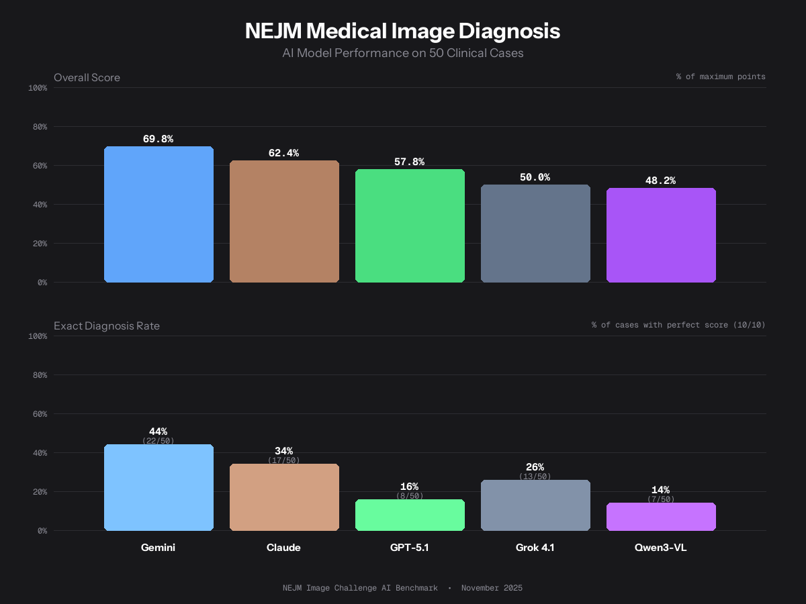

# NEJM Medical Image Diagnosis Benchmark

Benchmarking frontier AI models on real clinical image diagnosis using the [NEJM Image Challenge](https://www.nejm.org/image-challenge) dataset.



## Results (November 2025)

| Model | Overall Score | Exact Diagnosis Rate |
|-------|---------------|---------------------|
| **Gemini 3 Pro** | 69.8% | 44% (22/50) |
| Claude Opus 4.5 | 62.4% | 34% (17/50) |
| GPT-5.1 | 57.8% | 16% (8/50) |
| Grok 4.1 | 50.0% | 26% (13/50) |
| Qwen3-VL 235B | 48.2% | 14% (7/50) |

## How It Works

1. **Dataset**: 50 randomly sampled cases from the NEJM Image Challenge (seed=42 for reproducibility)
2. **Task**: Each model receives a clinical image + patient history and must provide a single diagnosis
3. **Scoring**: An independent judge model (Claude Sonnet 4) scores responses 0-10:
   - 10 = Exact match
   - 9 = Synonymous term
   - 8 = Correct specific subtype
   - 7 = Correct broader category
   - 5-6 = Related condition
   - 3-4 = Partially related
   - 1-2 = Wrong but medically plausible
   - 0 = Completely wrong

## Key Findings

- **Gemini 3 Pro** dominated with 44% exact diagnosis rate, nearly 3x GPT-5.1's 16%
- **Grok 4.1** (free tier) outperformed GPT-5.1 and Qwen on exact matches despite lower overall scores
- **Qwen3-VL 235B** performed worst despite being the largest model (235B parameters)
- 25/50 cases had ties between 2+ models, but when there was a clear winner, Gemini usually took it

## Running the Benchmark

```bash
# Install dependencies
pip install httpx python-dotenv pillow

# Set your OpenRouter API key
export OPENROUTER_API_KEY=your_key_here

# Run the full benchmark
python benchmark.py

# Or run individual models
python run_grok.py
python run_qwen.py
```

## Configuration

Edit `config.py` to customize:
- `SAMPLE_SIZE`: Number of challenges to test (default: 50)
- `RANDOM_SEED`: For reproducibility (default: 42)
- `MODELS`: Which models to benchmark

## Files

- `benchmark.py` - Main benchmark orchestration
- `config.py` - Model configurations and prompts
- `dataset.py` - NEJM dataset loading
- `models.py` - OpenRouter API client
- `judge.py` - Response scoring logic
- `results/` - Benchmark results and visualizations

## Dataset

Uses the publicly available [NEJM Image Challenge dataset](https://github.com/cx0/nejm-image-challenge) compiled by cx0.

## License

MIT
